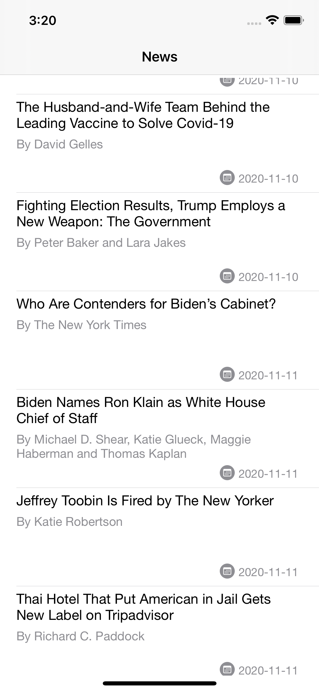
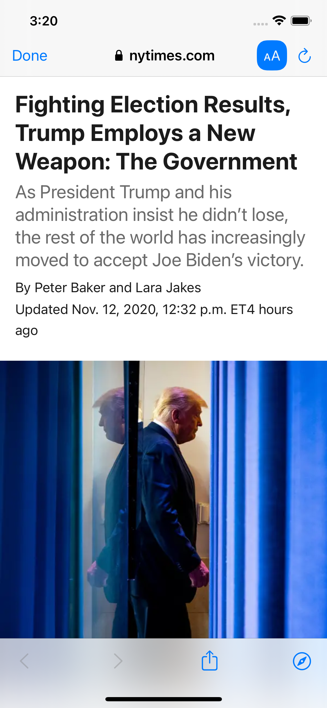

# NewsReader

- App Consumes Rest Api by https://developer.nytimes.com/
- Open the app and run it either on simulator or connect an iphone.
- It uses MVVM architecture.
- NetworkService is unit tested using Expectation
- SFSafariViewController is used as recommended by apple to load the detail page.
  

